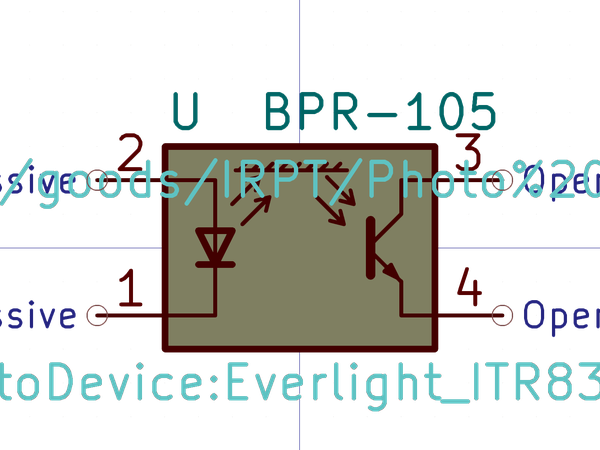

# OOMP Symbol  
## bpr_105  by kicad  
  
oomp key: none  
  
source repo at: [https://gitlab.com/kicad/libraries/kicad-symbols](https://gitlab.com/kicad/libraries/kicad-symbols)  
## Symbol  
  
  
| name | value | 
| --- | --- | 
| symbol name | Sensor_Proximity | 
| library name | Sensor_Proximity | 
| oomp key | none | 
| oomp bot github |  | 
## Images  
