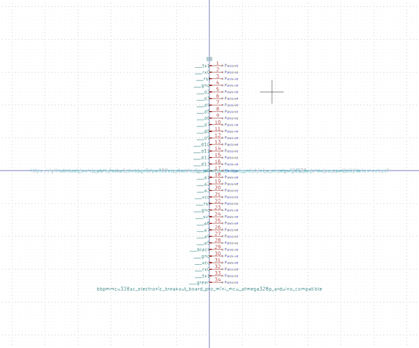

# OOMP Symbol  
## bbpmmcu328ac_electronic_breakout_board_pro_mini_mcu_atmega328p_arduino_compatible  by oomlout  
  
oomp key: oomp_oomlout_oomlout_oomp_part_symbols_bbpmmcu328ac_electronic_breakout_board_pro_mini_mcu_atmega328p_arduino_compatible  
  
source repo at: [https://github.com/oomlout/oomlout_oomp_part_kicad_symbols](https://github.com/oomlout/oomlout_oomp_part_kicad_symbols)  
## Symbol  
  
  
| name | value | 
| --- | --- | 
| symbol name | oomlout_oomp_part_symbols | 
| library name | oomlout_oomp_part_symbols | 
| oomp key | oomp_oomlout_oomlout_oomp_part_symbols_bbpmmcu328ac_electronic_breakout_board_pro_mini_mcu_atmega328p_arduino_compatible | 
| oomp bot github | https://github.com/oomlout/oomlout_oomp_symbol_bot/tree/main/oomlout_oomlout_oomp_part_symbols_bbpmmcu328ac_electronic_breakout_board_pro_mini_mcu_atmega328p_arduino_compatible/working | 
## Images  
