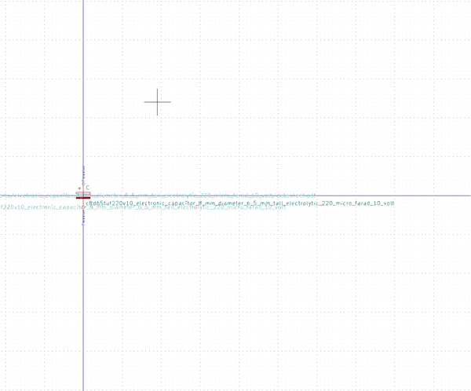

# OOMP Symbol  
## c8d65tuf220v10_electronic_capacitor_8_mm_diameter_6_5_mm_tall_electrolytic_220_micro_farad_10_volt  by oomlout  
  
oomp key: oomp_oomlout_oomlout_oomp_part_symbols_c8d65tuf220v10_electronic_capacitor_8_mm_diameter_6_5_mm_tall_electrolytic_220_micro_farad_10_volt  
  
source repo at: [https://github.com/oomlout/oomlout_oomp_part_kicad_symbols](https://github.com/oomlout/oomlout_oomp_part_kicad_symbols)  
## Symbol  
  
  
| name | value | 
| --- | --- | 
| symbol name | oomlout_oomp_part_symbols | 
| library name | oomlout_oomp_part_symbols | 
| oomp key | oomp_oomlout_oomlout_oomp_part_symbols_c8d65tuf220v10_electronic_capacitor_8_mm_diameter_6_5_mm_tall_electrolytic_220_micro_farad_10_volt | 
| oomp bot github | https://github.com/oomlout/oomlout_oomp_symbol_bot/tree/main/oomlout_oomlout_oomp_part_symbols_c8d65tuf220v10_electronic_capacitor_8_mm_diameter_6_5_mm_tall_electrolytic_220_micro_farad_10_volt/working | 
## Images  
