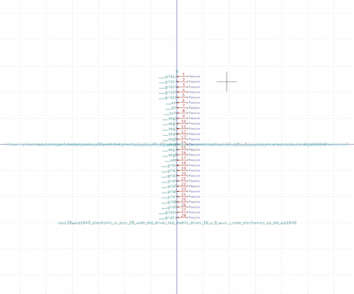
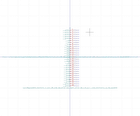

# OOMP Symbol  
## isoic28waip1640_electronic_ic_soic_28_wide_led_driver_led_matrix_driver_16_x_8_wuxi_i_core_electronics_co_ltd_aip1640  by oomlout  
  
oomp key: oomp_oomlout_oomlout_oomp_part_symbols_isoic28waip1640_electronic_ic_soic_28_wide_led_driver_led_matrix_driver_16_x_8_wuxi_i_core_electronics_co_ltd_aip1640  
  
source repo at: [https://github.com/oomlout/oomlout_oomp_part_kicad_symbols](https://github.com/oomlout/oomlout_oomp_part_kicad_symbols)  
## Symbol  
  
  
| name | value | 
| --- | --- | 
| symbol name | oomlout_oomp_part_symbols | 
| library name | oomlout_oomp_part_symbols | 
| oomp key | oomp_oomlout_oomlout_oomp_part_symbols_isoic28waip1640_electronic_ic_soic_28_wide_led_driver_led_matrix_driver_16_x_8_wuxi_i_core_electronics_co_ltd_aip1640 | 
| oomp bot github | https://github.com/oomlout/oomlout_oomp_symbol_bot/tree/main/oomlout_oomlout_oomp_part_symbols_isoic28waip1640_electronic_ic_soic_28_wide_led_driver_led_matrix_driver_16_x_8_wuxi_i_core_electronics_co_ltd_aip1640/working | 
## Images  
  
  
