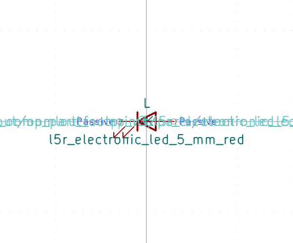

# OOMP Symbol  
## l5r_electronic_led_5_mm_red  by oomlout  
  
oomp key: oomp_oomlout_oomlout_oomp_part_symbols_l5r_electronic_led_5_mm_red  
  
source repo at: [https://github.com/oomlout/oomlout_oomp_part_kicad_symbols](https://github.com/oomlout/oomlout_oomp_part_kicad_symbols)  
## Symbol  
  
  
| name | value | 
| --- | --- | 
| symbol name | oomlout_oomp_part_symbols | 
| library name | oomlout_oomp_part_symbols | 
| oomp key | oomp_oomlout_oomlout_oomp_part_symbols_l5r_electronic_led_5_mm_red | 
| oomp bot github | https://github.com/oomlout/oomlout_oomp_symbol_bot/tree/main/oomlout_oomlout_oomp_part_symbols_l5r_electronic_led_5_mm_red/working | 
## Images  
