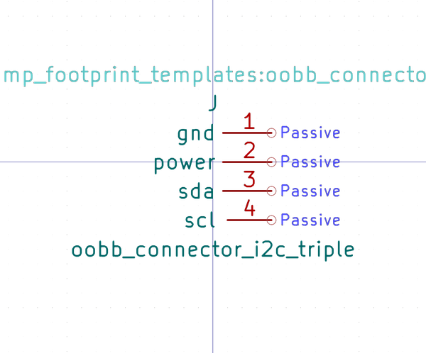

# OOMP Symbol  
## oobb_connector_i2c_triple  by oomlout  
  
oomp key: oomp_oomlout_oomlout_oomp_part_templates_oobb_connector_i2c_triple  
  
source repo at: [https://github.com/oomlout/oomlout_oomp_part_templates](https://github.com/oomlout/oomlout_oomp_part_templates)  
## Symbol  
  
  
| name | value | 
| --- | --- | 
| symbol name | oomlout_oomp_part_templates | 
| library name | oomlout_oomp_part_templates | 
| oomp key | oomp_oomlout_oomlout_oomp_part_templates_oobb_connector_i2c_triple | 
| oomp bot github | https://github.com/oomlout/oomlout_oomp_symbol_bot/tree/main/oomlout_oomlout_oomp_part_templates_oobb_connector_i2c_triple/working | 
## Images  
